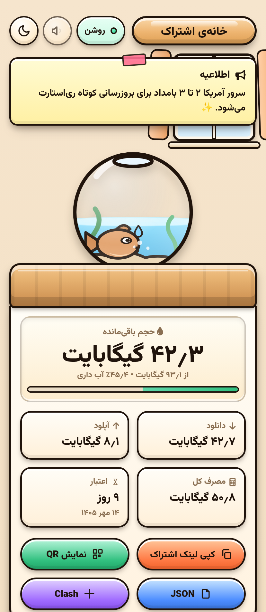
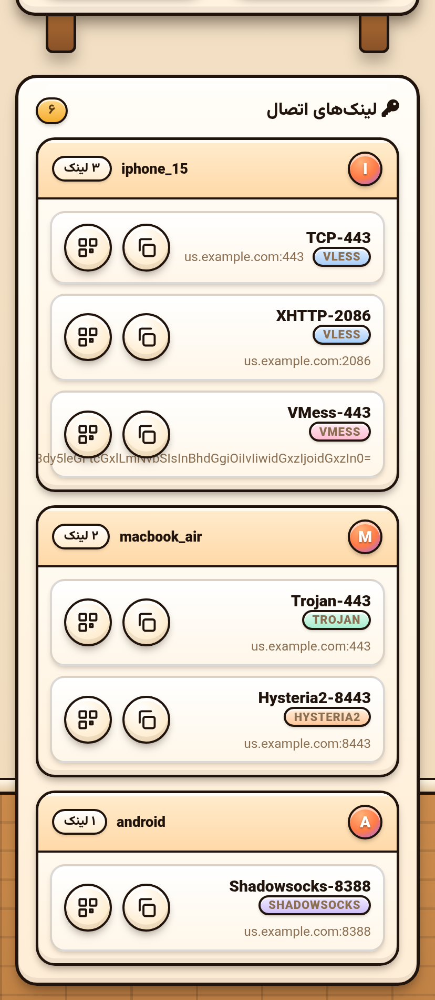
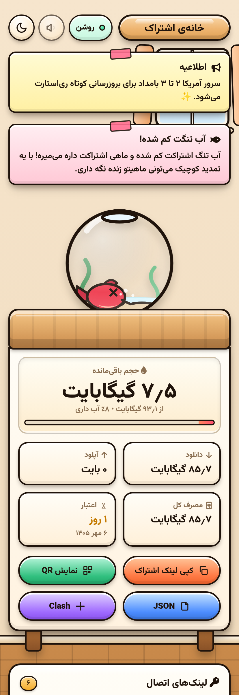
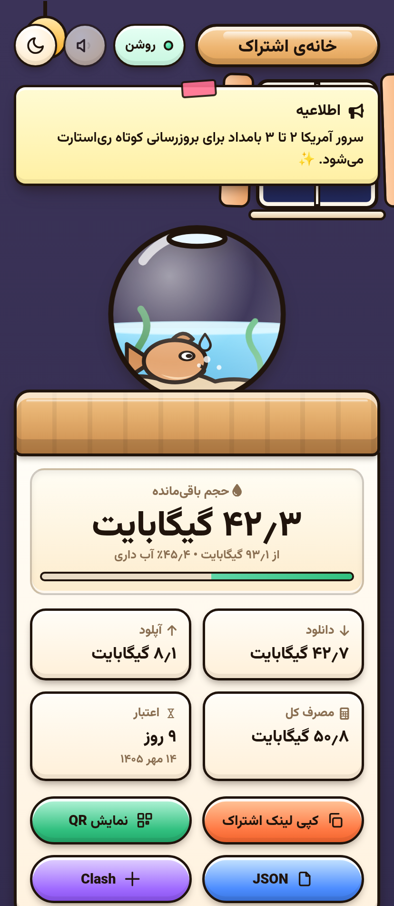
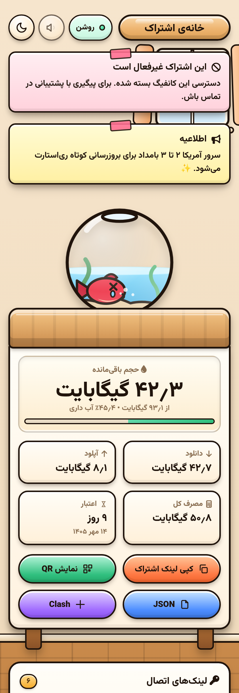

# 🐠 Goldfish Subscription — 3x-ui White-label Sub Page

A custom subscription page theme for **3x-ui** panels — a cozy **goldfish-bowl** design.
RTL-first Persian, fully white-label: no seller name, no support/renew buttons, no external services.

| | |
|---|---|
|  |  |
| Home — fishbowl water = remaining traffic | Configs — grouped links, copy, QR |
|  |  |
| Low water — orange water + renewal nudge | Dark theme — night window, moon & stars |
|  | |
| Disabled — red notice + fish out of order | |

## ✨ Features
- 🐠 **Fishbowl gauge** — remaining traffic is the **water level**; the fish reacts to it:
  `idle → weak (≤50%) → panic (≤20%) → dying (expired/disabled)`, with a renewal nudge banner at low water
- 💧 **Water turns orange** when the subscription runs low; unlimited plans show `∞`
- 📊 **Usage drawer** — download / upload / total, remaining bytes, expiry countdown (Persian calendar)
- 🟢 **Online pill** — live status from the panel (`isOnline`), auto-polls every 10s (paused on hidden tab)
- 📢 **Announcement sticky-note** — panel announce text rendered as a taped paper note; auto-hidden when empty
- 🖼 **Animated room** — window with sun/moon + stars, swaying plant, drifting clouds, day/night themes
- 🔊 **Optional sounds** — tiny WebAudio blips on copy/usage changes; toggle in the header, remembered
- 🎊 **Confetti** on successful copy — respects `prefers-reduced-motion`
- 📱 **QR codes generated locally** in-page (lazy-loads qrcodejs from CDN; shows a copy fallback if offline)
- 🧩 **IPv6-safe layout** · iPhone safe-area insets · `<noscript>` fallback lists raw links
- 🔒 **Zero branding** — safe to hand to resellers; nothing points back to the seller

## ⚡ نصب سریع / Quick Install

برای نصب یا آپدیت، این دستور را روی سرور پنل (با کاربر root) اجرا کنید:

```bash
bash <(curl -fsSL https://raw.githubusercontent.com/frank0live/goldfish-subscription/main/install.sh)
```

نصب‌کننده این کارها را خودکار انجام می‌دهد:
1. بررسی root و تشخیص پنل 3x-ui
2. دانلود `sub.html` و بررسی sha256
3. کپی در `/etc/3x-ui/sub_templates/goldfish/`
4. بکاپ امن از دیتابیس (`x-ui.db`) قبل از هر تغییر
5. تنظیم خودکار کلید `subThemeDir` (upsert تک‌کلیدی)
6. ری‌استارت پنل + تست رندر (در صورت خطا خودکار برمی‌گردد)

### نصب دستی (بدون اسکریپت)
1. در تنظیمات پنل، قالب اشتراک سفارشی (**custom subscription**) را فعال کنید.
2. `subThemeDir` را به پوشه‌ای که `sub.html` داخل آن است اشاره دهید.

## 📱 Compatibility
| Panel version | Status |
|---|---|
| **3x-ui v3.8.x** | ✅ Full (uses `announce` / `isOnline`) |
| **3x-ui v3.6.0+** | ✅ Full (`announce` / `isOnline` supported) |
| **3x-ui < v3.6.0** | ✅ Works — banner & online pill auto-hide, zero errors |

## 📁 Files
- **`sub.html`** — production file (Go template). Drop it into your panel's custom subscription theme dir.
- **`demo.html`** — the same page rendered with fake data — open directly in a browser to preview.
  Query params: `?days=1` (near expiry), `?used=92` (low water), `?on=0` (fish asleep), `?en=0` (disabled page), `?theme=dark` (night mode), `?y=800` (scroll).
- **`install.sh`** — one-line installer (see above).
- `shots/` — screenshots for this README.

---

## 🔗 ارتباط / Contact

سوال، سفارش یا پشتیبانی نصب؟ از تلگرام پیام بدهید:

**📬 [@master_supports](https://t.me/master_supports)** — https://t.me/master_supports

---

## فارسی
صفحهٔ اشتراک سفارشی و **وایت‌لیبل** برای پنل **3x-ui** با طراحی تنگ ماهی.

- **`sub.html`** فایل اصلی (کافیست در پوشهٔ قالب اشتراک سفارشی پنل قرار بگیرد) — **`demo.html`** پیش‌نمایش با دادهٔ جعلی.
- بدون هیچ نام/برند فروشنده، بدون دکمهٔ پشتیبانی یا تمدید — کاملاً وایت‌لیبل.
- **سطح آب تنگ = حجم باقی‌ماندهٔ اشتراک**؛ ماهی با حال اشتراک راه می‌رود (سالم / ضعیف / وحشت‌زده / در حال مرگ) و با اتمام حجم یک بنر تمدید نشان می‌دهد.
- کارت مصرف (دانلود/آپلود/کل)، شمارش معکوس اعتبار با تقویم فارسی، چراغ آنلاین زنده، بنر اعلان پنل، QR محلی (بدون سرویس بیرونی)، صداهای دلپذیر با کلید خاموش/روشن، تم روز/شب با اتاق متحرک (خورشید/ماه، پنجره، گلدان، ابر).
- `<noscript>` لینک‌های خام را نشان می‌دهد؛ چیدمان IPv6-safe و سازگار با safe-area آیفون.
- روی پنل‌های قدیمی‌تر از 3.6.0 (بدون فیلدهای `announce`/`isOnline`) همه‌چیز بی‌خطا و خودکار مخفی می‌شود.

**نصب خودکار:** `bash <(curl -fsSL https://raw.githubusercontent.com/frank0live/goldfish-subscription/main/install.sh)`

**نصب دستی:** در تنظیمات پنل، قالب اشتراک سفارشی را فعال کن و `subThemeDir` را به پوشه‌ای که `sub.html` داخل آن است اشاره بده.
